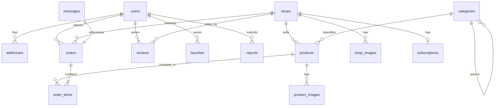

# Product Requirement Document (PRD) - Gully Trader MVP

Gully Trader is a mobile-first, hyperlocal marketplace platform designed to empower neighborhood shopkeepers ("Gully Traders") and connect them directly with nearby customers. The platform operates on a zero-transaction-fee subscription model for shops, facilitating discovery, direct communication, and local delivery configuration.

---

## 1. User Roles & Experiences

### 1.1 Customer
A local consumer seeking to discover and purchase from neighborhood stores.
* **Onboarding & Location Access**: 
  * Mandatory location permission prompt on signup/first open to enable hyperlocal functionality.
  * Capability to save multiple addresses (e.g., Home, Work, Other).
  * Selection of a default delivery address to govern search relevance and filter matching.
* **Discovery & Search**:
  * Distance-based shop and product search filtered by search radius (1 KM, 3 KM, 5 KM, 10 KM, or Entire City).
  * Category hierarchy browser (e.g., Grocery -> Fruits; Electronics -> Accessories).
* **Shop Interactions**:
  * View Shop Homepage with public options: **Chat**, **Call**, **Share**, and **View Products** (direct "Place Order" button removed from homepage to streamline user flow).
  * View Product Catalog, select variants, and view availability.
* **Cart & Checkout**:
  * Single-shop restriction per cart (customers can only order from one shop per checkout transaction to simplify local logistics).
  * Cancellation options: Can cancel an order freely before it is accepted by the shop.
* **Reviews**:
  * Can write a rating and review *only* for shops where they have successfully completed at least one order (prevents spam and fake ratings).
* **Wishlist**:
  * Save favorite products and shops.
  * Subscribe to stock notifications for out-of-stock items.

### 1.2 Shopkeeper
A local merchant managing storefront listings, orders, and delivery settings.
* **Storefront Management**:
  * Configure shop details, category classification, and upload shop images (1 to 5).
  * Control Shop Status: **Open**, **Closing Soon**, **Closed**, **Temporarily Closed**, or **Holiday**.
  * Configure delivery rules: Delivery available (Yes/No), Delivery radius (in KM), Delivery charge, Free delivery threshold, and Estimated Delivery Time (ETA).
* **Product Catalog**:
  * Add and edit products with titles, descriptions, categories, and stock availability statuses: **In Stock**, **Limited Stock**, and **Out of Stock**.
  * Define product variants (e.g., Grocery: 500g/1kg/5kg; Clothing: S/M/L/XL; Electronics: Black/White/Blue).
  * Upload product images (minimum 1, maximum 5).
* **Order Fulfillment**:
  * View incoming orders, accept or reject them before dispatch.
  * Transition order states: Pending -> Accepted -> Dispatched -> Completed.
  * Cancellation: Can reject/cancel the order anytime before it is dispatched. Once dispatched, cancellation is disabled.
* **Analytics Dashboard**:
  * Replaces monetary revenue tracking (as transactions are not processed on-platform) with operational engagement metrics:
    * Orders received & completed.
    * Product views & Profile visits.
    * Search impressions.
    * Repeat customers rate.
    * Conversion rate (orders completed / profile visits).
    * Total product count.
* **Subscription Management**:
  * Pay platform subscription fee to keep capabilities active.

### 1.3 Platform Admin
A system administrator overseeing the platform, subscriptions, verification, and abuse control.
* **Admin Dashboard**:
  * Tracks high-level operational and business metrics:
    * Subscription revenue & Active subscriptions.
    * Subscriber churn rate.
    * Total active shops & New registrations.
* **Shop Verification**:
  * Manage and assign Shop Verification Levels:
    * **Basic Shop**: Mobile number verified only.
    * **Verified Shop**: Business verification documents completed.
    * **Premium Verified Shop**: GST details and physical address verified.
* **Abuse Protection & Moderation**:
  * Review user-submitted reports: Spam reporting, Fake product reporting, and Shop reporting.
  * Block malicious/fraudulent users or suspend non-compliant shops.

---

## 2. Core Business Rules & Logics

### 2.1 Subscription Rules
| State | Search Visibility | Add Products | Receive Orders | UI Notice |
| :--- | :--- | :--- | :--- | :--- |
| **Active Subscription** | Visible in local search | Enabled | Enabled | None |
| **Expired Subscription** | Visible (retains SEO ranking) | Disabled | Disabled | Subscription expired banner shown to shopkeeper |

### 2.2 Order & Cart Rules
* **Single Shop Enforcement**: A cart validation check prevents adding items from Shop B if items from Shop A are already in the cart.
* **Cancellation Lifecycle**:
  ```mermaid
  stateDiagram-v2
    [*] --> Pending : Order Placed
    Pending --> Accepted : Shop Accepts (Customer can cancel here)
    Pending --> Rejected : Shop Rejects
    Accepted --> Dispatched : Shop Dispatches (Customer cannot cancel)
    Dispatched --> Completed : Delivered / Received
    Dispatched --> Undelivered : Delivery Failed
  ```

---

## 3. SEO & Progressive Web App (PWA) Requirements

### 3.1 SEO Strategy (Shop SEO Pages)
To capture local organic search intent, the platform automatically generates static/ISR SEO landing pages with clean slugs:
* `localshop.in/grocery-stores-in-[city]`
* `localshop.in/[category]-shops-in-[locality]`
* `localshop.in/[product-keyword]-near-[locality]`

### 3.2 Progressive Web App (PWA)
* Add a manifest file and register service workers.
* Allow "Add to Home Screen" prompt on Android devices.
* Enable offline caching for shop pages, catalogs, and cart structures to handle unstable local mobile networks.
* Enable background sync for notifications (new orders for shopkeepers, dispatch updates for customers).

---

## 4. Suggested Database Schema



### Table Definitions

1. **`users`**
   * `id` (uuid, PK)
   * `email` (text)
   * `phone` (text, unique)
   * `full_name` (text)
   * `role` (text) -- 'customer', 'shopkeeper', 'admin'
   * `created_at` (timestamptz)

2. **`shops`**
   * `id` (uuid, PK)
   * `owner_id` (uuid, FK -> users.id)
   * `name` (text)
   * `description` (text)
   * `phone` (text)
   * `verification_level` (text) -- 'basic', 'verified', 'premium'
   * `status` (text) -- 'open', 'closing_soon', 'closed', 'temporarily_closed', 'holiday'
   * `delivery_available` (boolean)
   * `delivery_radius_km` (numeric)
   * `delivery_charge` (numeric)
   * `free_delivery_threshold` (numeric)
   * `estimated_delivery_time` (text) -- e.g. "30-45 minutes"
   * `latitude` (numeric)
   * `longitude` (numeric)
   * `created_at` (timestamptz)

3. **`products`**
   * `id` (uuid, PK)
   * `shop_id` (uuid, FK -> shops.id)
   * `category_id` (uuid, FK -> categories.id)
   * `name` (text)
   * `description` (text)
   * `price` (numeric)
   * `availability_status` (text) -- 'in_stock', 'limited_stock', 'out_of_stock'
   * `variants` (jsonb) -- e.g., [{"variant_id": "1", "name": "1kg", "price_override": 100}]
   * `created_at` (timestamptz)

4. **`categories`**
   * `id` (uuid, PK)
   * `name` (text)
   * `parent_id` (uuid, FK -> categories.id, nullable) -- supporting hierarchical structures
   * `slug` (text, unique)

5. **`orders`**
   * `id` (uuid, PK)
   * `customer_id` (uuid, FK -> users.id)
   * `shop_id` (uuid, FK -> shops.id)
   * `status` (text) -- 'pending', 'accepted', 'rejected', 'dispatched', 'completed', 'cancelled'
   * `delivery_address` (text)
   * `delivery_charge` (numeric)
   * `total_amount` (numeric)
   * `created_at` (timestamptz)
   * `updated_at` (timestamptz)

6. **`order_items`**
   * `id` (uuid, PK)
   * `order_id` (uuid, FK -> orders.id)
   * `product_id` (uuid, FK -> products.id)
   * `variant_name` (text, nullable)
   * `quantity` (integer)
   * `price_per_item` (numeric)

7. **`messages`**
   * `id` (uuid, PK)
   * `sender_id` (uuid, FK -> users.id)
   * `receiver_id` (uuid, FK -> users.id)
   * `order_id` (uuid, FK -> orders.id, nullable)
   * `message_text` (text)
   * `created_at` (timestamptz)

8. **`reviews`**
   * `id` (uuid, PK)
   * `customer_id` (uuid, FK -> users.id)
   * `shop_id` (uuid, FK -> shops.id)
   * `rating` (integer) -- 1 to 5
   * `review_text` (text)
   * `created_at` (timestamptz)

9. **`subscriptions`**
   * `id` (uuid, PK)
   * `shop_id` (uuid, FK -> shops.id)
   * `status` (text) -- 'active', 'expired'
   * `ends_at` (timestamptz)
   * `created_at` (timestamptz)

10. **`addresses`**
    * `id` (uuid, PK)
    * `user_id` (uuid, FK -> users.id)
    * `address_line` (text)
    * `latitude` (numeric)
    * `longitude` (numeric)
    * `is_default` (boolean)
    * `created_at` (timestamptz)

11. **`favorites`**
    * `id` (uuid, PK)
    * `user_id` (uuid, FK -> users.id)
    * `product_id` (uuid, FK -> products.id, nullable)
    * `shop_id` (uuid, FK -> shops.id, nullable)
    * `created_at` (timestamptz)

12. **`notifications`**
    * `id` (uuid, PK)
    * `user_id` (uuid, FK -> users.id)
    * `title` (text)
    * `body` (text)
    * `read` (boolean)
    * `created_at` (timestamptz)

13. **`product_images`**
    * `id` (uuid, PK)
    * `product_id` (uuid, FK -> products.id)
    * `image_url` (text)
    * `created_at` (timestamptz)

14. **`shop_images`**
    * `id` (uuid, PK)
    * `shop_id` (uuid, FK -> shops.id)
    * `image_url` (text)
    * `created_at` (timestamptz)

15. **`reports`**
    * `id` (uuid, PK)
    * `reporter_id` (uuid, FK -> users.id)
    * `reported_shop_id` (uuid, FK -> shops.id, nullable)
    * `reported_product_id` (uuid, FK -> products.id, nullable)
    * `reason` (text)
    * `status` (text) -- 'pending', 'resolved', 'dismissed'
    * `created_at` (timestamptz)
